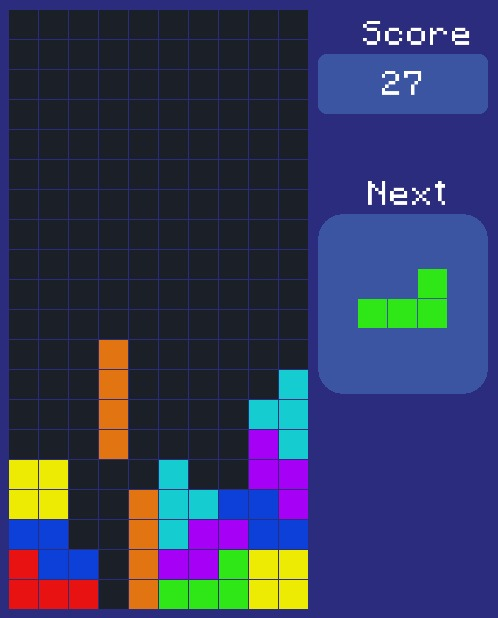
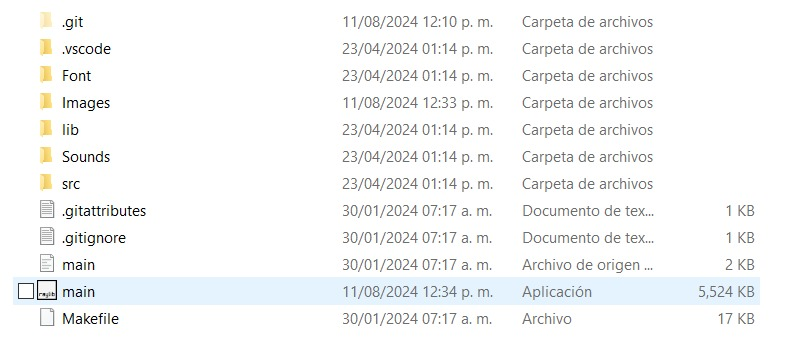
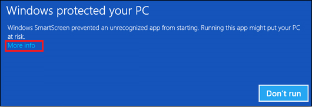

# About
This is a project made for fun in early 2024 (although uploaded in mid 2024) intended to help me learn advanced OOP concepts and C++ programming. Tetris is a classic retro game that
almost everybody knows about, and I can say that mimicking is one of the best learning strategies; that's why I decided to make this project out!

  

## Requirements
Fortunately, there is no pre-requisite in order to run this game! In short, you'll learn how to run it on your computer...

## Running the game
- Download the source code and decompress it on a folder.
- Open the executable file called "main".
- Have fun!

  

## Warning
It might appear a message that says "Windows protected your computer". In that case, just select "More info" and then "Run anyway" :).

  

